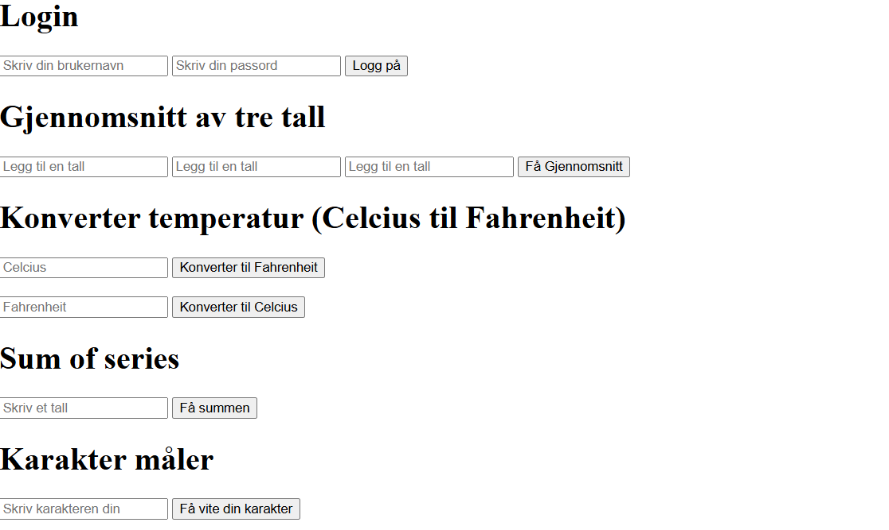

<h1 align="center">Javascript 1 Øvelse</h1>

  <h3>
    <a href="https://ande-glitch.github.io/Javascript-velse-1/index.html">
      Link to project
    </a>
  </h3>

<!-- TABLE OF CONTENTS -->

## Table of Contents

- [Overview](#overview)
- [Built With](#built-with)
- [Features](#features)
- [How to use](#how-to-use)
- [Contact](#contact)

<!-- OVERVIEW -->
## Overview
- En nettside som har flere Javascript funksjoner til å nå ulike effekter. Du kan få se resultatene på konsolen.

## Features
- Gjennomsnitt av 3 tall
- Sum of series funksjon
- Celcius til Fahrenheit 

## Utfordringer
- Formel til Sum of series
- Matte

## Løsning
- Samarbeid
- Hjelp av klassekamerater

## Contact
- GitHub [Ande-Glitch](https://github.com/Ande-glitch)
- Epost [And Nguyen](mailto:andynuwen@gmail.com)

## Result

# Javascript-velse-1
